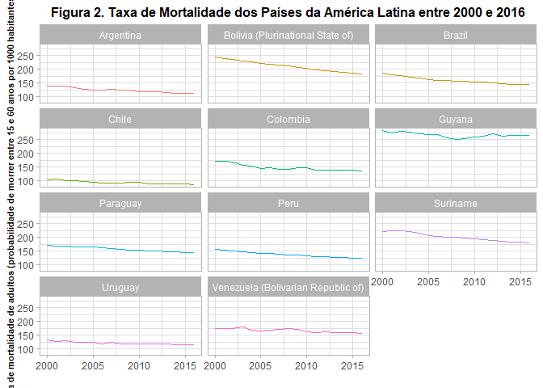
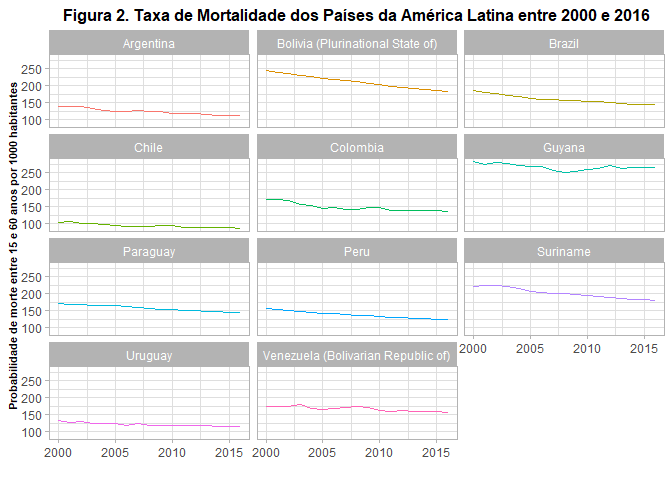
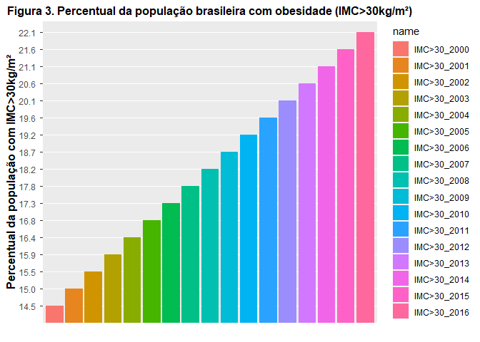
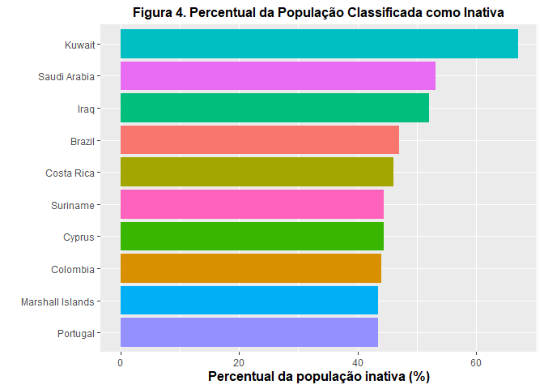

<!-- README.md is generated from README.Rmd. Please edit that file -->

# Obesidade e Inatividade Física como Fatores de Risco de Mortalidade na População Brasileira

<!-- badges: start -->

<!-- badges: end -->

O objetivo deste projeto foi verificar os países com maior taxa de
mortalidade a partir da análise da base de dados disponibilizada pela
Organização Mundial de Saúde (World Health Organization – WHO),
verificar como o Brasil está disposto nesta lista considerando todos os
países e apenas os países da América do Sul no qual o Brasil faz parte
e, por fim, verificar a prevalência de obesidade e inatividade dois
importantes fatores de risco para mortalidade. Primeiramente, foi
analisada a base de dados de mortalidade da WHO. Considerando todos os
países do mundo, o Brasil encontra-se na posição 86. A tabela abaixo
(Tabela 1) mostra os dados por pais divididos por sexo a fim de ilustrar
a probabilidade de morte entre 15 e 60 anos por 1000 habitantes listando
os países por ordem alfabética.

<table>

<caption>

Tabela 1. Probabilidade de morte entre 15 e 60 anos por 1000 habitantes.

</caption>

<thead>

<tr>

<th style="text-align:center;">

País

</th>

<th style="text-align:center;">

Ambos sexos

</th>

<th style="text-align:center;">

Homem

</th>

<th style="text-align:center;">

Mulher

</th>

</tr>

</thead>

<tbody>

<tr>

<td style="text-align:center;">

Afghanistan

</td>

<td style="text-align:center;">

245

</td>

<td style="text-align:center;">

272

</td>

<td style="text-align:center;">

216

</td>

</tr>

<tr>

<td style="text-align:center;">

Albania

</td>

<td style="text-align:center;">

96

</td>

<td style="text-align:center;">

122

</td>

<td style="text-align:center;">

71

</td>

</tr>

<tr>

<td style="text-align:center;">

Algeria

</td>

<td style="text-align:center;">

95

</td>

<td style="text-align:center;">

106

</td>

<td style="text-align:center;">

84

</td>

</tr>

<tr>

<td style="text-align:center;">

Angola

</td>

<td style="text-align:center;">

238

</td>

<td style="text-align:center;">

275

</td>

<td style="text-align:center;">

202

</td>

</tr>

<tr>

<td style="text-align:center;">

Antigua and Barbuda

</td>

<td style="text-align:center;">

120

</td>

<td style="text-align:center;">

137

</td>

<td style="text-align:center;">

104

</td>

</tr>

<tr>

<td style="text-align:center;">

Argentina

</td>

<td style="text-align:center;">

111

</td>

<td style="text-align:center;">

143

</td>

<td style="text-align:center;">

80

</td>

</tr>

<tr>

<td style="text-align:center;">

Armenia

</td>

<td style="text-align:center;">

116

</td>

<td style="text-align:center;">

176

</td>

<td style="text-align:center;">

65

</td>

</tr>

<tr>

<td style="text-align:center;">

Australia

</td>

<td style="text-align:center;">

61

</td>

<td style="text-align:center;">

77

</td>

<td style="text-align:center;">

45

</td>

</tr>

<tr>

<td style="text-align:center;">

Austria

</td>

<td style="text-align:center;">

62

</td>

<td style="text-align:center;">

80

</td>

<td style="text-align:center;">

44

</td>

</tr>

<tr>

<td style="text-align:center;">

Azerbaijan

</td>

<td style="text-align:center;">

118

</td>

<td style="text-align:center;">

160

</td>

<td style="text-align:center;">

76

</td>

</tr>

<tr>

<td style="text-align:center;">

Bahamas

</td>

<td style="text-align:center;">

159

</td>

<td style="text-align:center;">

199

</td>

<td style="text-align:center;">

120

</td>

</tr>

<tr>

<td style="text-align:center;">

Bahrain

</td>

<td style="text-align:center;">

57

</td>

<td style="text-align:center;">

61

</td>

<td style="text-align:center;">

50

</td>

</tr>

<tr>

<td style="text-align:center;">

Bangladesh

</td>

<td style="text-align:center;">

130

</td>

<td style="text-align:center;">

150

</td>

<td style="text-align:center;">

110

</td>

</tr>

<tr>

<td style="text-align:center;">

Barbados

</td>

<td style="text-align:center;">

100

</td>

<td style="text-align:center;">

129

</td>

<td style="text-align:center;">

74

</td>

</tr>

<tr>

<td style="text-align:center;">

Belarus

</td>

<td style="text-align:center;">

161

</td>

<td style="text-align:center;">

241

</td>

<td style="text-align:center;">

82

</td>

</tr>

<tr>

<td style="text-align:center;">

Belgium

</td>

<td style="text-align:center;">

72

</td>

<td style="text-align:center;">

89

</td>

<td style="text-align:center;">

54

</td>

</tr>

<tr>

<td style="text-align:center;">

Belize

</td>

<td style="text-align:center;">

179

</td>

<td style="text-align:center;">

225

</td>

<td style="text-align:center;">

132

</td>

</tr>

<tr>

<td style="text-align:center;">

Benin

</td>

<td style="text-align:center;">

242

</td>

<td style="text-align:center;">

265

</td>

<td style="text-align:center;">

220

</td>

</tr>

<tr>

<td style="text-align:center;">

Bhutan

</td>

<td style="text-align:center;">

207

</td>

<td style="text-align:center;">

205

</td>

<td style="text-align:center;">

209

</td>

</tr>

<tr>

<td style="text-align:center;">

Bolivia (Plurinational State of)

</td>

<td style="text-align:center;">

182

</td>

<td style="text-align:center;">

214

</td>

<td style="text-align:center;">

150

</td>

</tr>

<tr>

<td style="text-align:center;">

Bosnia and Herzegovina

</td>

<td style="text-align:center;">

92

</td>

<td style="text-align:center;">

120

</td>

<td style="text-align:center;">

63

</td>

</tr>

<tr>

<td style="text-align:center;">

Botswana

</td>

<td style="text-align:center;">

249

</td>

<td style="text-align:center;">

294

</td>

<td style="text-align:center;">

208

</td>

</tr>

<tr>

<td style="text-align:center;">

Brazil

</td>

<td style="text-align:center;">

143

</td>

<td style="text-align:center;">

194

</td>

<td style="text-align:center;">

91

</td>

</tr>

<tr>

<td style="text-align:center;">

Brunei Darussalam

</td>

<td style="text-align:center;">

98

</td>

<td style="text-align:center;">

111

</td>

<td style="text-align:center;">

83

</td>

</tr>

<tr>

<td style="text-align:center;">

Bulgaria

</td>

<td style="text-align:center;">

135

</td>

<td style="text-align:center;">

183

</td>

<td style="text-align:center;">

85

</td>

</tr>

<tr>

<td style="text-align:center;">

Burkina Faso

</td>

<td style="text-align:center;">

255

</td>

<td style="text-align:center;">

273

</td>

<td style="text-align:center;">

239

</td>

</tr>

<tr>

<td style="text-align:center;">

Burundi

</td>

<td style="text-align:center;">

290

</td>

<td style="text-align:center;">

320

</td>

<td style="text-align:center;">

260

</td>

</tr>

<tr>

<td style="text-align:center;">

Cabo Verde

</td>

<td style="text-align:center;">

122

</td>

<td style="text-align:center;">

146

</td>

<td style="text-align:center;">

100

</td>

</tr>

<tr>

<td style="text-align:center;">

Cambodia

</td>

<td style="text-align:center;">

170

</td>

<td style="text-align:center;">

205

</td>

<td style="text-align:center;">

140

</td>

</tr>

<tr>

<td style="text-align:center;">

Cameroon

</td>

<td style="text-align:center;">

341

</td>

<td style="text-align:center;">

362

</td>

<td style="text-align:center;">

321

</td>

</tr>

<tr>

<td style="text-align:center;">

Canada

</td>

<td style="text-align:center;">

63

</td>

<td style="text-align:center;">

76

</td>

<td style="text-align:center;">

49

</td>

</tr>

<tr>

<td style="text-align:center;">

Central African Republic

</td>

<td style="text-align:center;">

412

</td>

<td style="text-align:center;">

431

</td>

<td style="text-align:center;">

394

</td>

</tr>

<tr>

<td style="text-align:center;">

Chad

</td>

<td style="text-align:center;">

360

</td>

<td style="text-align:center;">

381

</td>

<td style="text-align:center;">

338

</td>

</tr>

<tr>

<td style="text-align:center;">

Chile

</td>

<td style="text-align:center;">

87

</td>

<td style="text-align:center;">

114

</td>

<td style="text-align:center;">

60

</td>

</tr>

<tr>

<td style="text-align:center;">

China

</td>

<td style="text-align:center;">

80

</td>

<td style="text-align:center;">

93

</td>

<td style="text-align:center;">

67

</td>

</tr>

<tr>

<td style="text-align:center;">

Colombia

</td>

<td style="text-align:center;">

137

</td>

<td style="text-align:center;">

182

</td>

<td style="text-align:center;">

92

</td>

</tr>

<tr>

<td style="text-align:center;">

Comoros

</td>

<td style="text-align:center;">

225

</td>

<td style="text-align:center;">

250

</td>

<td style="text-align:center;">

199

</td>

</tr>

<tr>

<td style="text-align:center;">

Congo

</td>

<td style="text-align:center;">

261

</td>

<td style="text-align:center;">

281

</td>

<td style="text-align:center;">

239

</td>

</tr>

<tr>

<td style="text-align:center;">

Costa Rica

</td>

<td style="text-align:center;">

97

</td>

<td style="text-align:center;">

126

</td>

<td style="text-align:center;">

66

</td>

</tr>

<tr>

<td style="text-align:center;">

Côte d’Ivoire

</td>

<td style="text-align:center;">

398

</td>

<td style="text-align:center;">

417

</td>

<td style="text-align:center;">

376

</td>

</tr>

<tr>

<td style="text-align:center;">

Croatia

</td>

<td style="text-align:center;">

88

</td>

<td style="text-align:center;">

124

</td>

<td style="text-align:center;">

51

</td>

</tr>

<tr>

<td style="text-align:center;">

Cuba

</td>

<td style="text-align:center;">

92

</td>

<td style="text-align:center;">

116

</td>

<td style="text-align:center;">

68

</td>

</tr>

<tr>

<td style="text-align:center;">

Cyprus

</td>

<td style="text-align:center;">

55

</td>

<td style="text-align:center;">

73

</td>

<td style="text-align:center;">

37

</td>

</tr>

<tr>

<td style="text-align:center;">

Czechia

</td>

<td style="text-align:center;">

81

</td>

<td style="text-align:center;">

108

</td>

<td style="text-align:center;">

53

</td>

</tr>

<tr>

<td style="text-align:center;">

Democratic People’s Republic of Korea

</td>

<td style="text-align:center;">

132

</td>

<td style="text-align:center;">

166

</td>

<td style="text-align:center;">

98

</td>

</tr>

<tr>

<td style="text-align:center;">

Democratic Republic of the Congo

</td>

<td style="text-align:center;">

256

</td>

<td style="text-align:center;">

281

</td>

<td style="text-align:center;">

232

</td>

</tr>

<tr>

<td style="text-align:center;">

Denmark

</td>

<td style="text-align:center;">

65

</td>

<td style="text-align:center;">

81

</td>

<td style="text-align:center;">

49

</td>

</tr>

<tr>

<td style="text-align:center;">

Djibouti

</td>

<td style="text-align:center;">

245

</td>

<td style="text-align:center;">

266

</td>

<td style="text-align:center;">

222

</td>

</tr>

<tr>

<td style="text-align:center;">

Dominican Republic

</td>

<td style="text-align:center;">

160

</td>

<td style="text-align:center;">

202

</td>

<td style="text-align:center;">

117

</td>

</tr>

<tr>

<td style="text-align:center;">

Ecuador

</td>

<td style="text-align:center;">

114

</td>

<td style="text-align:center;">

142

</td>

<td style="text-align:center;">

86

</td>

</tr>

<tr>

<td style="text-align:center;">

Egypt

</td>

<td style="text-align:center;">

165

</td>

<td style="text-align:center;">

205

</td>

<td style="text-align:center;">

121

</td>

</tr>

<tr>

<td style="text-align:center;">

El Salvador

</td>

<td style="text-align:center;">

177

</td>

<td style="text-align:center;">

261

</td>

<td style="text-align:center;">

103

</td>

</tr>

<tr>

<td style="text-align:center;">

Equatorial Guinea

</td>

<td style="text-align:center;">

305

</td>

<td style="text-align:center;">

338

</td>

<td style="text-align:center;">

259

</td>

</tr>

<tr>

<td style="text-align:center;">

Eritrea

</td>

<td style="text-align:center;">

252

</td>

<td style="text-align:center;">

289

</td>

<td style="text-align:center;">

215

</td>

</tr>

<tr>

<td style="text-align:center;">

Estonia

</td>

<td style="text-align:center;">

119

</td>

<td style="text-align:center;">

172

</td>

<td style="text-align:center;">

65

</td>

</tr>

<tr>

<td style="text-align:center;">

Eswatini

</td>

<td style="text-align:center;">

393

</td>

<td style="text-align:center;">

464

</td>

<td style="text-align:center;">

338

</td>

</tr>

<tr>

<td style="text-align:center;">

Ethiopia

</td>

<td style="text-align:center;">

219

</td>

<td style="text-align:center;">

246

</td>

<td style="text-align:center;">

194

</td>

</tr>

<tr>

<td style="text-align:center;">

Fiji

</td>

<td style="text-align:center;">

186

</td>

<td style="text-align:center;">

233

</td>

<td style="text-align:center;">

136

</td>

</tr>

<tr>

<td style="text-align:center;">

Finland

</td>

<td style="text-align:center;">

70

</td>

<td style="text-align:center;">

95

</td>

<td style="text-align:center;">

44

</td>

</tr>

<tr>

<td style="text-align:center;">

France

</td>

<td style="text-align:center;">

71

</td>

<td style="text-align:center;">

94

</td>

<td style="text-align:center;">

48

</td>

</tr>

<tr>

<td style="text-align:center;">

Gabon

</td>

<td style="text-align:center;">

221

</td>

<td style="text-align:center;">

239

</td>

<td style="text-align:center;">

201

</td>

</tr>

<tr>

<td style="text-align:center;">

Gambia

</td>

<td style="text-align:center;">

262

</td>

<td style="text-align:center;">

290

</td>

<td style="text-align:center;">

235

</td>

</tr>

<tr>

<td style="text-align:center;">

Georgia

</td>

<td style="text-align:center;">

160

</td>

<td style="text-align:center;">

238

</td>

<td style="text-align:center;">

83

</td>

</tr>

<tr>

<td style="text-align:center;">

Germany

</td>

<td style="text-align:center;">

69

</td>

<td style="text-align:center;">

88

</td>

<td style="text-align:center;">

49

</td>

</tr>

<tr>

<td style="text-align:center;">

Ghana

</td>

<td style="text-align:center;">

241

</td>

<td style="text-align:center;">

262

</td>

<td style="text-align:center;">

222

</td>

</tr>

<tr>

<td style="text-align:center;">

Greece

</td>

<td style="text-align:center;">

66

</td>

<td style="text-align:center;">

90

</td>

<td style="text-align:center;">

42

</td>

</tr>

<tr>

<td style="text-align:center;">

Grenada

</td>

<td style="text-align:center;">

140

</td>

<td style="text-align:center;">

183

</td>

<td style="text-align:center;">

96

</td>

</tr>

<tr>

<td style="text-align:center;">

Guatemala

</td>

<td style="text-align:center;">

162

</td>

<td style="text-align:center;">

208

</td>

<td style="text-align:center;">

119

</td>

</tr>

<tr>

<td style="text-align:center;">

Guinea

</td>

<td style="text-align:center;">

262

</td>

<td style="text-align:center;">

273

</td>

<td style="text-align:center;">

251

</td>

</tr>

<tr>

<td style="text-align:center;">

Guinea-Bissau

</td>

<td style="text-align:center;">

269

</td>

<td style="text-align:center;">

297

</td>

<td style="text-align:center;">

242

</td>

</tr>

<tr>

<td style="text-align:center;">

Guyana

</td>

<td style="text-align:center;">

264

</td>

<td style="text-align:center;">

313

</td>

<td style="text-align:center;">

210

</td>

</tr>

<tr>

<td style="text-align:center;">

Haiti

</td>

<td style="text-align:center;">

243

</td>

<td style="text-align:center;">

276

</td>

<td style="text-align:center;">

211

</td>

</tr>

<tr>

<td style="text-align:center;">

Honduras

</td>

<td style="text-align:center;">

145

</td>

<td style="text-align:center;">

172

</td>

<td style="text-align:center;">

119

</td>

</tr>

<tr>

<td style="text-align:center;">

Hungary

</td>

<td style="text-align:center;">

126

</td>

<td style="text-align:center;">

173

</td>

<td style="text-align:center;">

79

</td>

</tr>

<tr>

<td style="text-align:center;">

Iceland

</td>

<td style="text-align:center;">

55

</td>

<td style="text-align:center;">

67

</td>

<td style="text-align:center;">

42

</td>

</tr>

<tr>

<td style="text-align:center;">

India

</td>

<td style="text-align:center;">

178

</td>

<td style="text-align:center;">

214

</td>

<td style="text-align:center;">

138

</td>

</tr>

<tr>

<td style="text-align:center;">

Indonesia

</td>

<td style="text-align:center;">

176

</td>

<td style="text-align:center;">

205

</td>

<td style="text-align:center;">

146

</td>

</tr>

<tr>

<td style="text-align:center;">

Iran (Islamic Republic of)

</td>

<td style="text-align:center;">

80

</td>

<td style="text-align:center;">

99

</td>

<td style="text-align:center;">

60

</td>

</tr>

<tr>

<td style="text-align:center;">

Iraq

</td>

<td style="text-align:center;">

174

</td>

<td style="text-align:center;">

213

</td>

<td style="text-align:center;">

133

</td>

</tr>

<tr>

<td style="text-align:center;">

Ireland

</td>

<td style="text-align:center;">

62

</td>

<td style="text-align:center;">

78

</td>

<td style="text-align:center;">

47

</td>

</tr>

<tr>

<td style="text-align:center;">

Israel

</td>

<td style="text-align:center;">

58

</td>

<td style="text-align:center;">

75

</td>

<td style="text-align:center;">

41

</td>

</tr>

<tr>

<td style="text-align:center;">

Italy

</td>

<td style="text-align:center;">

54

</td>

<td style="text-align:center;">

68

</td>

<td style="text-align:center;">

39

</td>

</tr>

<tr>

<td style="text-align:center;">

Jamaica

</td>

<td style="text-align:center;">

131

</td>

<td style="text-align:center;">

165

</td>

<td style="text-align:center;">

98

</td>

</tr>

<tr>

<td style="text-align:center;">

Japan

</td>

<td style="text-align:center;">

51

</td>

<td style="text-align:center;">

65

</td>

<td style="text-align:center;">

36

</td>

</tr>

<tr>

<td style="text-align:center;">

Jordan

</td>

<td style="text-align:center;">

111

</td>

<td style="text-align:center;">

128

</td>

<td style="text-align:center;">

92

</td>

</tr>

<tr>

<td style="text-align:center;">

Kazakhstan

</td>

<td style="text-align:center;">

181

</td>

<td style="text-align:center;">

256

</td>

<td style="text-align:center;">

108

</td>

</tr>

<tr>

<td style="text-align:center;">

Kenya

</td>

<td style="text-align:center;">

219

</td>

<td style="text-align:center;">

256

</td>

<td style="text-align:center;">

184

</td>

</tr>

<tr>

<td style="text-align:center;">

Kiribati

</td>

<td style="text-align:center;">

197

</td>

<td style="text-align:center;">

240

</td>

<td style="text-align:center;">

156

</td>

</tr>

<tr>

<td style="text-align:center;">

Kuwait

</td>

<td style="text-align:center;">

79

</td>

<td style="text-align:center;">

93

</td>

<td style="text-align:center;">

57

</td>

</tr>

<tr>

<td style="text-align:center;">

Kyrgyzstan

</td>

<td style="text-align:center;">

162

</td>

<td style="text-align:center;">

224

</td>

<td style="text-align:center;">

100

</td>

</tr>

<tr>

<td style="text-align:center;">

Lao People’s Democratic Republic

</td>

<td style="text-align:center;">

193

</td>

<td style="text-align:center;">

215

</td>

<td style="text-align:center;">

171

</td>

</tr>

<tr>

<td style="text-align:center;">

Latvia

</td>

<td style="text-align:center;">

154

</td>

<td style="text-align:center;">

225

</td>

<td style="text-align:center;">

84

</td>

</tr>

<tr>

<td style="text-align:center;">

Lebanon

</td>

<td style="text-align:center;">

96

</td>

<td style="text-align:center;">

105

</td>

<td style="text-align:center;">

83

</td>

</tr>

<tr>

<td style="text-align:center;">

Lesotho

</td>

<td style="text-align:center;">

483

</td>

<td style="text-align:center;">

536

</td>

<td style="text-align:center;">

445

</td>

</tr>

<tr>

<td style="text-align:center;">

Liberia

</td>

<td style="text-align:center;">

230

</td>

<td style="text-align:center;">

249

</td>

<td style="text-align:center;">

212

</td>

</tr>

<tr>

<td style="text-align:center;">

Libya

</td>

<td style="text-align:center;">

150

</td>

<td style="text-align:center;">

196

</td>

<td style="text-align:center;">

103

</td>

</tr>

<tr>

<td style="text-align:center;">

Lithuania

</td>

<td style="text-align:center;">

155

</td>

<td style="text-align:center;">

231

</td>

<td style="text-align:center;">

79

</td>

</tr>

<tr>

<td style="text-align:center;">

Luxembourg

</td>

<td style="text-align:center;">

56

</td>

<td style="text-align:center;">

71

</td>

<td style="text-align:center;">

38

</td>

</tr>

<tr>

<td style="text-align:center;">

Madagascar

</td>

<td style="text-align:center;">

216

</td>

<td style="text-align:center;">

241

</td>

<td style="text-align:center;">

191

</td>

</tr>

<tr>

<td style="text-align:center;">

Malawi

</td>

<td style="text-align:center;">

255

</td>

<td style="text-align:center;">

312

</td>

<td style="text-align:center;">

203

</td>

</tr>

<tr>

<td style="text-align:center;">

Malaysia

</td>

<td style="text-align:center;">

123

</td>

<td style="text-align:center;">

156

</td>

<td style="text-align:center;">

86

</td>

</tr>

<tr>

<td style="text-align:center;">

Maldives

</td>

<td style="text-align:center;">

53

</td>

<td style="text-align:center;">

63

</td>

<td style="text-align:center;">

39

</td>

</tr>

<tr>

<td style="text-align:center;">

Mali

</td>

<td style="text-align:center;">

270

</td>

<td style="text-align:center;">

279

</td>

<td style="text-align:center;">

261

</td>

</tr>

<tr>

<td style="text-align:center;">

Malta

</td>

<td style="text-align:center;">

55

</td>

<td style="text-align:center;">

71

</td>

<td style="text-align:center;">

38

</td>

</tr>

<tr>

<td style="text-align:center;">

Mauritania

</td>

<td style="text-align:center;">

202

</td>

<td style="text-align:center;">

224

</td>

<td style="text-align:center;">

181

</td>

</tr>

<tr>

<td style="text-align:center;">

Mauritius

</td>

<td style="text-align:center;">

145

</td>

<td style="text-align:center;">

194

</td>

<td style="text-align:center;">

94

</td>

</tr>

<tr>

<td style="text-align:center;">

Mexico

</td>

<td style="text-align:center;">

127

</td>

<td style="text-align:center;">

164

</td>

<td style="text-align:center;">

89

</td>

</tr>

<tr>

<td style="text-align:center;">

Micronesia (Federated States of)

</td>

<td style="text-align:center;">

164

</td>

<td style="text-align:center;">

181

</td>

<td style="text-align:center;">

148

</td>

</tr>

<tr>

<td style="text-align:center;">

Mongolia

</td>

<td style="text-align:center;">

211

</td>

<td style="text-align:center;">

294

</td>

<td style="text-align:center;">

127

</td>

</tr>

<tr>

<td style="text-align:center;">

Montenegro

</td>

<td style="text-align:center;">

99

</td>

<td style="text-align:center;">

131

</td>

<td style="text-align:center;">

67

</td>

</tr>

<tr>

<td style="text-align:center;">

Morocco

</td>

<td style="text-align:center;">

69

</td>

<td style="text-align:center;">

74

</td>

<td style="text-align:center;">

65

</td>

</tr>

<tr>

<td style="text-align:center;">

Mozambique

</td>

<td style="text-align:center;">

336

</td>

<td style="text-align:center;">

386

</td>

<td style="text-align:center;">

292

</td>

</tr>

<tr>

<td style="text-align:center;">

Myanmar

</td>

<td style="text-align:center;">

195

</td>

<td style="text-align:center;">

229

</td>

<td style="text-align:center;">

163

</td>

</tr>

<tr>

<td style="text-align:center;">

Namibia

</td>

<td style="text-align:center;">

296

</td>

<td style="text-align:center;">

344

</td>

<td style="text-align:center;">

253

</td>

</tr>

<tr>

<td style="text-align:center;">

Nepal

</td>

<td style="text-align:center;">

151

</td>

<td style="text-align:center;">

171

</td>

<td style="text-align:center;">

131

</td>

</tr>

<tr>

<td style="text-align:center;">

Netherlands

</td>

<td style="text-align:center;">

59

</td>

<td style="text-align:center;">

66

</td>

<td style="text-align:center;">

52

</td>

</tr>

<tr>

<td style="text-align:center;">

New Zealand

</td>

<td style="text-align:center;">

66

</td>

<td style="text-align:center;">

81

</td>

<td style="text-align:center;">

51

</td>

</tr>

<tr>

<td style="text-align:center;">

Nicaragua

</td>

<td style="text-align:center;">

146

</td>

<td style="text-align:center;">

190

</td>

<td style="text-align:center;">

103

</td>

</tr>

<tr>

<td style="text-align:center;">

Niger

</td>

<td style="text-align:center;">

250

</td>

<td style="text-align:center;">

263

</td>

<td style="text-align:center;">

235

</td>

</tr>

<tr>

<td style="text-align:center;">

Nigeria

</td>

<td style="text-align:center;">

352

</td>

<td style="text-align:center;">

372

</td>

<td style="text-align:center;">

333

</td>

</tr>

<tr>

<td style="text-align:center;">

Norway

</td>

<td style="text-align:center;">

55

</td>

<td style="text-align:center;">

66

</td>

<td style="text-align:center;">

42

</td>

</tr>

<tr>

<td style="text-align:center;">

Oman

</td>

<td style="text-align:center;">

96

</td>

<td style="text-align:center;">

108

</td>

<td style="text-align:center;">

68

</td>

</tr>

<tr>

<td style="text-align:center;">

Pakistan

</td>

<td style="text-align:center;">

159

</td>

<td style="text-align:center;">

178

</td>

<td style="text-align:center;">

139

</td>

</tr>

<tr>

<td style="text-align:center;">

Panama

</td>

<td style="text-align:center;">

111

</td>

<td style="text-align:center;">

145

</td>

<td style="text-align:center;">

76

</td>

</tr>

<tr>

<td style="text-align:center;">

Papua New Guinea

</td>

<td style="text-align:center;">

224

</td>

<td style="text-align:center;">

256

</td>

<td style="text-align:center;">

191

</td>

</tr>

<tr>

<td style="text-align:center;">

Paraguay

</td>

<td style="text-align:center;">

146

</td>

<td style="text-align:center;">

165

</td>

<td style="text-align:center;">

125

</td>

</tr>

<tr>

<td style="text-align:center;">

Peru

</td>

<td style="text-align:center;">

124

</td>

<td style="text-align:center;">

154

</td>

<td style="text-align:center;">

94

</td>

</tr>

<tr>

<td style="text-align:center;">

Philippines

</td>

<td style="text-align:center;">

194

</td>

<td style="text-align:center;">

244

</td>

<td style="text-align:center;">

141

</td>

</tr>

<tr>

<td style="text-align:center;">

Poland

</td>

<td style="text-align:center;">

111

</td>

<td style="text-align:center;">

158

</td>

<td style="text-align:center;">

62

</td>

</tr>

<tr>

<td style="text-align:center;">

Portugal

</td>

<td style="text-align:center;">

76

</td>

<td style="text-align:center;">

110

</td>

<td style="text-align:center;">

43

</td>

</tr>

<tr>

<td style="text-align:center;">

Qatar

</td>

<td style="text-align:center;">

62

</td>

<td style="text-align:center;">

66

</td>

<td style="text-align:center;">

47

</td>

</tr>

<tr>

<td style="text-align:center;">

Republic of Korea

</td>

<td style="text-align:center;">

61

</td>

<td style="text-align:center;">

85

</td>

<td style="text-align:center;">

36

</td>

</tr>

<tr>

<td style="text-align:center;">

Republic of Moldova

</td>

<td style="text-align:center;">

167

</td>

<td style="text-align:center;">

241

</td>

<td style="text-align:center;">

95

</td>

</tr>

<tr>

<td style="text-align:center;">

North Macedonia

</td>

<td style="text-align:center;">

96

</td>

<td style="text-align:center;">

124

</td>

<td style="text-align:center;">

66

</td>

</tr>

<tr>

<td style="text-align:center;">

Romania

</td>

<td style="text-align:center;">

135

</td>

<td style="text-align:center;">

191

</td>

<td style="text-align:center;">

77

</td>

</tr>

<tr>

<td style="text-align:center;">

Russian Federation

</td>

<td style="text-align:center;">

203

</td>

<td style="text-align:center;">

294

</td>

<td style="text-align:center;">

111

</td>

</tr>

<tr>

<td style="text-align:center;">

Rwanda

</td>

<td style="text-align:center;">

198

</td>

<td style="text-align:center;">

224

</td>

<td style="text-align:center;">

172

</td>

</tr>

<tr>

<td style="text-align:center;">

Saint Lucia

</td>

<td style="text-align:center;">

147

</td>

<td style="text-align:center;">

178

</td>

<td style="text-align:center;">

116

</td>

</tr>

<tr>

<td style="text-align:center;">

Saint Vincent and the Grenadines

</td>

<td style="text-align:center;">

169

</td>

<td style="text-align:center;">

208

</td>

<td style="text-align:center;">

126

</td>

</tr>

<tr>

<td style="text-align:center;">

Samoa

</td>

<td style="text-align:center;">

110

</td>

<td style="text-align:center;">

137

</td>

<td style="text-align:center;">

80

</td>

</tr>

<tr>

<td style="text-align:center;">

Sao Tome and Principe

</td>

<td style="text-align:center;">

191

</td>

<td style="text-align:center;">

221

</td>

<td style="text-align:center;">

161

</td>

</tr>

<tr>

<td style="text-align:center;">

Saudi Arabia

</td>

<td style="text-align:center;">

89

</td>

<td style="text-align:center;">

97

</td>

<td style="text-align:center;">

78

</td>

</tr>

<tr>

<td style="text-align:center;">

Senegal

</td>

<td style="text-align:center;">

185

</td>

<td style="text-align:center;">

222

</td>

<td style="text-align:center;">

153

</td>

</tr>

<tr>

<td style="text-align:center;">

Serbia

</td>

<td style="text-align:center;">

103

</td>

<td style="text-align:center;">

135

</td>

<td style="text-align:center;">

70

</td>

</tr>

<tr>

<td style="text-align:center;">

Seychelles

</td>

<td style="text-align:center;">

163

</td>

<td style="text-align:center;">

233

</td>

<td style="text-align:center;">

90

</td>

</tr>

<tr>

<td style="text-align:center;">

Sierra Leone

</td>

<td style="text-align:center;">

389

</td>

<td style="text-align:center;">

394

</td>

<td style="text-align:center;">

383

</td>

</tr>

<tr>

<td style="text-align:center;">

Singapore

</td>

<td style="text-align:center;">

51

</td>

<td style="text-align:center;">

65

</td>

<td style="text-align:center;">

38

</td>

</tr>

<tr>

<td style="text-align:center;">

Slovakia

</td>

<td style="text-align:center;">

104

</td>

<td style="text-align:center;">

147

</td>

<td style="text-align:center;">

61

</td>

</tr>

<tr>

<td style="text-align:center;">

Slovenia

</td>

<td style="text-align:center;">

72

</td>

<td style="text-align:center;">

97

</td>

<td style="text-align:center;">

45

</td>

</tr>

<tr>

<td style="text-align:center;">

Solomon Islands

</td>

<td style="text-align:center;">

146

</td>

<td style="text-align:center;">

164

</td>

<td style="text-align:center;">

126

</td>

</tr>

<tr>

<td style="text-align:center;">

Somalia

</td>

<td style="text-align:center;">

316

</td>

<td style="text-align:center;">

349

</td>

<td style="text-align:center;">

282

</td>

</tr>

<tr>

<td style="text-align:center;">

South Africa

</td>

<td style="text-align:center;">

301

</td>

<td style="text-align:center;">

359

</td>

<td style="text-align:center;">

246

</td>

</tr>

<tr>

<td style="text-align:center;">

South Sudan

</td>

<td style="text-align:center;">

321

</td>

<td style="text-align:center;">

335

</td>

<td style="text-align:center;">

308

</td>

</tr>

<tr>

<td style="text-align:center;">

Spain

</td>

<td style="text-align:center;">

56

</td>

<td style="text-align:center;">

74

</td>

<td style="text-align:center;">

38

</td>

</tr>

<tr>

<td style="text-align:center;">

Sri Lanka

</td>

<td style="text-align:center;">

131

</td>

<td style="text-align:center;">

191

</td>

<td style="text-align:center;">

73

</td>

</tr>

<tr>

<td style="text-align:center;">

Sudan

</td>

<td style="text-align:center;">

224

</td>

<td style="text-align:center;">

253

</td>

<td style="text-align:center;">

195

</td>

</tr>

<tr>

<td style="text-align:center;">

Suriname

</td>

<td style="text-align:center;">

180

</td>

<td style="text-align:center;">

224

</td>

<td style="text-align:center;">

135

</td>

</tr>

<tr>

<td style="text-align:center;">

Sweden

</td>

<td style="text-align:center;">

52

</td>

<td style="text-align:center;">

64

</td>

<td style="text-align:center;">

40

</td>

</tr>

<tr>

<td style="text-align:center;">

Switzerland

</td>

<td style="text-align:center;">

49

</td>

<td style="text-align:center;">

62

</td>

<td style="text-align:center;">

36

</td>

</tr>

<tr>

<td style="text-align:center;">

Syrian Arab Republic

</td>

<td style="text-align:center;">

301

</td>

<td style="text-align:center;">

388

</td>

<td style="text-align:center;">

202

</td>

</tr>

<tr>

<td style="text-align:center;">

Tajikistan

</td>

<td style="text-align:center;">

123

</td>

<td style="text-align:center;">

156

</td>

<td style="text-align:center;">

91

</td>

</tr>

<tr>

<td style="text-align:center;">

Thailand

</td>

<td style="text-align:center;">

147

</td>

<td style="text-align:center;">

203

</td>

<td style="text-align:center;">

91

</td>

</tr>

<tr>

<td style="text-align:center;">

Timor-Leste

</td>

<td style="text-align:center;">

150

</td>

<td style="text-align:center;">

176

</td>

<td style="text-align:center;">

122

</td>

</tr>

<tr>

<td style="text-align:center;">

Togo

</td>

<td style="text-align:center;">

265

</td>

<td style="text-align:center;">

284

</td>

<td style="text-align:center;">

248

</td>

</tr>

<tr>

<td style="text-align:center;">

Tonga

</td>

<td style="text-align:center;">

133

</td>

<td style="text-align:center;">

167

</td>

<td style="text-align:center;">

100

</td>

</tr>

<tr>

<td style="text-align:center;">

Trinidad and Tobago

</td>

<td style="text-align:center;">

172

</td>

<td style="text-align:center;">

222

</td>

<td style="text-align:center;">

119

</td>

</tr>

<tr>

<td style="text-align:center;">

Tunisia

</td>

<td style="text-align:center;">

91

</td>

<td style="text-align:center;">

111

</td>

<td style="text-align:center;">

71

</td>

</tr>

<tr>

<td style="text-align:center;">

Turkey

</td>

<td style="text-align:center;">

104

</td>

<td style="text-align:center;">

138

</td>

<td style="text-align:center;">

71

</td>

</tr>

<tr>

<td style="text-align:center;">

Turkmenistan

</td>

<td style="text-align:center;">

191

</td>

<td style="text-align:center;">

253

</td>

<td style="text-align:center;">

131

</td>

</tr>

<tr>

<td style="text-align:center;">

Uganda

</td>

<td style="text-align:center;">

288

</td>

<td style="text-align:center;">

333

</td>

<td style="text-align:center;">

243

</td>

</tr>

<tr>

<td style="text-align:center;">

Ukraine

</td>

<td style="text-align:center;">

180

</td>

<td style="text-align:center;">

264

</td>

<td style="text-align:center;">

98

</td>

</tr>

<tr>

<td style="text-align:center;">

United Arab Emirates

</td>

<td style="text-align:center;">

74

</td>

<td style="text-align:center;">

80

</td>

<td style="text-align:center;">

56

</td>

</tr>

<tr>

<td style="text-align:center;">

United Kingdom of Great Britain and Northern Ireland

</td>

<td style="text-align:center;">

67

</td>

<td style="text-align:center;">

81

</td>

<td style="text-align:center;">

52

</td>

</tr>

<tr>

<td style="text-align:center;">

United Republic of Tanzania

</td>

<td style="text-align:center;">

261

</td>

<td style="text-align:center;">

299

</td>

<td style="text-align:center;">

222

</td>

</tr>

<tr>

<td style="text-align:center;">

United States of America

</td>

<td style="text-align:center;">

114

</td>

<td style="text-align:center;">

142

</td>

<td style="text-align:center;">

86

</td>

</tr>

<tr>

<td style="text-align:center;">

Uruguay

</td>

<td style="text-align:center;">

114

</td>

<td style="text-align:center;">

149

</td>

<td style="text-align:center;">

79

</td>

</tr>

<tr>

<td style="text-align:center;">

Uzbekistan

</td>

<td style="text-align:center;">

131

</td>

<td style="text-align:center;">

167

</td>

<td style="text-align:center;">

96

</td>

</tr>

<tr>

<td style="text-align:center;">

Vanuatu

</td>

<td style="text-align:center;">

129

</td>

<td style="text-align:center;">

155

</td>

<td style="text-align:center;">

104

</td>

</tr>

<tr>

<td style="text-align:center;">

Venezuela (Bolivarian Republic of)

</td>

<td style="text-align:center;">

157

</td>

<td style="text-align:center;">

217

</td>

<td style="text-align:center;">

93

</td>

</tr>

<tr>

<td style="text-align:center;">

Viet Nam

</td>

<td style="text-align:center;">

125

</td>

<td style="text-align:center;">

182

</td>

<td style="text-align:center;">

66

</td>

</tr>

<tr>

<td style="text-align:center;">

Yemen

</td>

<td style="text-align:center;">

221

</td>

<td style="text-align:center;">

244

</td>

<td style="text-align:center;">

199

</td>

</tr>

<tr>

<td style="text-align:center;">

Zambia

</td>

<td style="text-align:center;">

286

</td>

<td style="text-align:center;">

324

</td>

<td style="text-align:center;">

250

</td>

</tr>

<tr>

<td style="text-align:center;">

Zimbabwe

</td>

<td style="text-align:center;">

334

</td>

<td style="text-align:center;">

371

</td>

<td style="text-align:center;">

303

</td>

</tr>

</tbody>

</table>

Na América latina, a Guiana Francesa lidera a lista com a maior
probabilidade de morte entre indivíduos com 15 a 60 anos de idade por
1000 pessoas. Já o Brasil encontra-se na 6° posição entre os países
latino-americanos, estando na frente da Colômbia (pois é, na frente da
Colômbia de Pablo Escobar), Peru, Argentina, Uruguai e Chile. Esses
dados estão apresentados em detalhes na figura 1. Adicionalmente, quando
observamos a evolução da probabilidade de morte dos países latinos
(Figura 2) nota-se que na última década esses valores permaneceram
praticamente estáveis mesmo com avanços e descobertas importantes nos
tratamentos de doenças crônicas como, por exemplo, hipertensão arterial,
diabetes, entre outras. Neste cenário identificar possíveis fatores de
risco de mortalidade se torna fundamental uma vez que a identificação
dos fatores de risco pode possibilitar o direcionamento de políticas
públicas e, a partir daí, reduzir os índices de mortalidade do Brasil.

<!-- -->

A obesidade e a inatividade física são reconhecidos preditores
independentes de mortalidade em distintas populações. Neste sentido, é
razoável especular que o Brasil apresente uma elevada prevalência de
obesidade e inatividade física o que poderia explicar, em parte, a
sustentada e elevada probabilidade de mortalidade observada na última
década na população brasileira. Além disso, tanto a obesidade quanto a
inatividade física estão associados a diversas doenças cardiometabólicas
tais como diabetes e hipertensão arterial e, como uma consequência, uma
piora na qualidade de vida. A série temporal de dados disponibilizados
pela WHO sobre obesidade mostra que desde o ano de 2000 o Brasil
apresenta um aumento na prevalência de obesidade sendo que, no ano de
2016, 22% da população apresentada índice de massa corporal (IMC) \> que
30 kg/m². A Figura 3 ilustra a prevalência da obesidade na população
brasileira entre os anos 2000 e 2016.

Com relação a inatividade física, até o final do ano passado, a WHO
considerava inativas todas aquelas pessoas que não conseguiam realizar
um total de 150 minutos por semana de atividades física moderadas e/ou
vigorosas como, por exemplo, caminhar rapidamente. Embora a WHO não
disponibilize séries temporais com relação aos dados de inatividade
física, estão disponíveis o percentual da população classificada como
inativo no ano de 2016. Ao analisar esses dados nota-se que o Brasil se
encontra na 4° posição considerando TODOS os países do mundo com 47% DE
TODA SUA POPULAÇÃO CLASSIFICADA COMO INATIVA.

Por fim, as análises das bases de dados da WHO de probabilidade de
mortalidade, prevalência de obesidade e nível de atividade física é
possível verificar que o Brasil apresenta uma elevada prevalência de
obesidade (22%) e inatividade física (47%) em sua população. Esses
resultados sugerem que políticas públicas devem buscar estratégias para
reduzir os índices de obesidade e inatividade física uma vez que estas
condições são reconhecidos preditores de mortalidade. Cumpre destacar
que as análises aqui realizadas não indicam uma relação de causalidade
entre as variáveis e alguma cautela deve ser tomada na interpretação dos
resultados.
