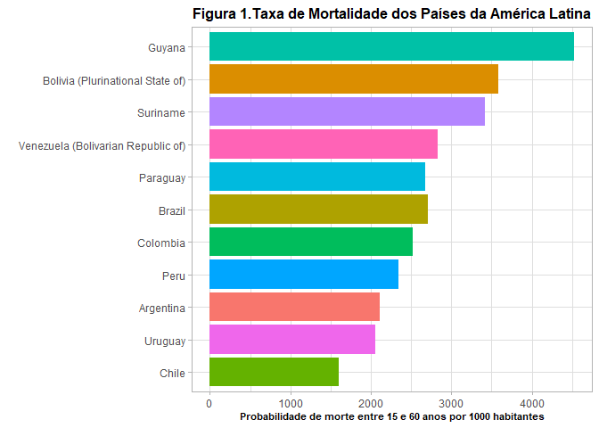

<!-- README.md is generated from README.Rmd. Please edit that file -->

# Obesidade e Inatividade Física como Fatores de Risco de Mortalidade na População Brasileira

<!-- badges: start -->
<!-- badges: end -->

O objetivo deste projeto foi verificar os países com maior taxa de
mortalidade a partir da análise da base de dados disponibilizada pela
Organização Mundial de Saúde (World Health Organization – WHO),
verificar como o Brasil está disposto nesta lista considerando todos os
países e apenas os países da América do Sul no qual o Brasil faz parte
e, por fim, verificar a prevalência de obesidade e inatividade dois
importantes fatores de risco para mortalidade. Primeiramente, foi
analisada a base de dados de mortalidade da WHO. Considerando todos os
países do mundo, o Brasil encontra-se na posição 86. Na América latina,
a Guiana Francesa lidera a lista com a maior probabilidade de morte
entre indivíduos com 15 a 60 anos de idade por 1000 pessoas. Já o Brasil
encontra-se na 6° posição entre os países latino-americanos, estando na
frente da Colômbia (pois é, na frente da Colômbia de Pablo Escobar),
Peru, Argentina, Uruguai e Chile. Esses dados estão apresentados em
detalhes na figura 1. Adicionalmente, quando observamos a evolução da
probabilidade de morte dos países latinos (Figura 2) nota-se que na
última década esses valores permaneceram praticamente estáveis mesmo com
avanços e descobertas importantes nos tratamentos de doenças crônicas
como, por exemplo, hipertensão arterial, diabetes, entre outras. Neste
cenário identificar possíveis fatores de risco de mortalidade se torna
fundamental uma vez que a identificação dos fatores de risco pode
possibilitar o direcionamento de políticas públicas e, a partir daí,
reduzir os índices de mortalidade do Brasil.

<!-- -->

A obesidade e a inatividade física são reconhecidos preditores
independentes de mortalidade em distintas populações. Neste sentido, é
razoável especular que o Brasil apresente uma elevada prevalência de
obesidade e inatividade física o que poderia explicar, em parte, a
sustentada e elevada probabilidade de mortalidade observada na última
década na população brasileira. Além disso, tanto a obesidade quanto a
inatividade física estão associados a diversas doenças cardiometabólicas
tais como diabetes e hipertensão arterial e, como uma consequência, uma
piora na qualidade de vida. A série temporal de dados disponibilizados
pela WHO sobre obesidade mostra que desde o ano de 2000 o Brasil
apresenta um aumento na prevalência de obesidade sendo que, no ano de
2016, 22% da população apresentada índice de massa corporal (IMC) &gt;
que 30 kg/m². A Figura 3 ilustra a prevalência da obesidade na população
brasileira entre os anos 2000 e 2016.

Com relação a inatividade física, até o final do ano passado, a WHO
considerava inativas todas aquelas pessoas que não conseguiam realizar
um total de 150 minutos por semana de atividades física moderadas e/ou
vigorosas como, por exemplo, caminhar rapidamente. Embora a WHO não
disponibilize séries temporais com relação aos dados de inatividade
física, estão disponíveis o percentual da população classificada como
inativo no ano de 2016. Ao analisar esses dados nota-se que o Brasil se
encontra na 4° posição considerando TODOS os países do mundo com 47% DE
TODA SUA POPULAÇÃO CLASSIFICADA COMO INATIVA.

Por fim, as análises das bases de dados da WHO de probabilidade de
mortalidade, prevalência de obesidade e nível de atividade física é
possível verificar que o Brasil apresenta uma elevada prevalência de
obesidade (22%) e inatividade física (47%) em sua população. Esses
resultados sugerem que políticas públicas devem buscar estratégias para
reduzir os índices de obesidade e inatividade física uma vez que estas
condições são reconhecidos preditores de mortalidade. Cumpre destacar
que as análises aqui realizadas não indicam uma relação de causalidade
entre as variáveis e alguma cautela deve ser tomada na interpretação dos
resultados.
